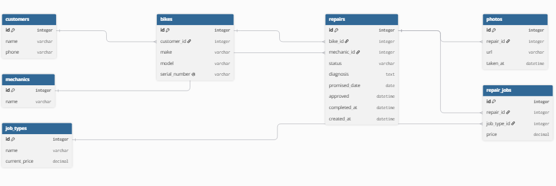

```
Table customers {
  id bigint [pk, increment]
  name varchar [not null]
  phone varchar [not null]
  created_at datetime [not null]
  updated_at datetime [not null]
}

Table bikes {
  id bigint [pk, increment]
  customer_id bigint [not null]
  make varchar [not null]
  model varchar [not null]
  color varchar [not null]
  serial_number varchar [not null, unique]
  created_at datetime [not null]
  updated_at datetime [not null]
}

Table staff_members {
  id bigint [pk, increment]
  name varchar [not null]
  role varchar [not null]
  created_at datetime [not null]
  updated_at datetime [not null]
}

Table services {
  id bigint [pk, increment]
  name varchar [not null, unique]
  price decimal(10, 2) [not null]
  created_at datetime [not null]
  updated_at datetime [not null]
}

Table repairs {
  id bigint [pk, increment]
  bike_id bigint [not null]
  staff_member_id bigint
  status varchar [not null, default: 'received']
  received_at datetime [not null]
  quoted_at datetime
  customer_response varchar
  customer_responded_at datetime
  promised_on date
  returned_at datetime
  created_at datetime [not null]
  updated_at datetime [not null]
}

Table repair_services {
  id bigint [pk, increment]
  repair_id bigint [not null]
  service_id bigint [not null]
  charged_price decimal(10, 2) [not null]
  created_at datetime [not null]
  updated_at datetime [not null]
}
```


| Entity | Story |
|---|---|
| customer | counter staff: record a customer's name and phones number when a bike arrives  |
| bikes | mechanic: record a bike's brand, model snd serial number at intake, so that two bikes are never to be confused  |
| mechanic | mechanic: write diagnosis and notes on a bike into the system, so that any mechanic or counter staff can answer a customer's call without walking to the back to find out |
| job_types |  Customer: see the shop's price list for common jobs on the website       |
| repairs    |Customer: be told the price of the repair and asked to approve it before any work begins |
| repair Job |Mechanic: select one or more jobs from the price list for a repair, so that the total cost is calculated consistently|
| photo       | Mechanic: take a picture of the bike at arrival, so that later nobody gets confused about who made a scratch |

## The thing and the copy of the thing
Every customer has their own bike, but the problem is that a bike is not
unique among everything else on the market. The mix-up in March was proof of
this, because those two bikes shared the same make and model, causing
confusion. Our system prevents this by giving each bike a serial number that
is unique across the whole shop, not just per customer. Even if two bikes
share almost every other characteristic, this specific detail cannot be
missed.

## Derived, or stored?
Our schema does not have a column for whether a repair is overdue. This value
can be calculated from data we already have: the promised date and the
current status. If the promised date already passed and the bike was not
picked up, the repair is overdue. We do not need to store this, because it
would go out of date the moment the day changes.

The price charged for a job looks like it could be derived too, but we stored
it anyway. The price list changes every January, and sometimes a mechanic
charges less than the list price for a regular customer. If we did not store
the price charged and used the current list price instead, old invoices would
change every time the list changes. That is exactly what the owner said
should not happen.

## Repair lifecycle

A repair starts as `received`. It can move to `quoted`, then to
`approved` after the customer accepts the quote. Approved repairs move to
`in_progress`, then `ready_for_pickup`, and finally `returned`.

A customer can reject a quote, moving the repair to `declined`.

## Changes since Lab 3

- Added `created_at` and `updated_at` to every table because Rails timestamps are required.
- Renamed `mechanics` to `staff_members` and added `role` so the three mechanics and the counter staff member can be stored in one table.
- Renamed `job_types` to `services` to match the price-list terminology used by the application.
- Renamed `current_price` to `price` in `services`.
- Renamed `repair_jobs` to `repair_services`.
- Renamed `job_type_id` to `service_id` in `repair_services`.
- Renamed `price` to `charged_price` in `repair_services` to preserve the historical price charged.
- Added `color` to `bikes` so identical make and model bicycles can be distinguished beyond their serial number.
- Renamed `mechanic_id` to `staff_member_id`; it allows NULL because a repair may arrive before a mechanic is assigned.
- Added `received_at`, `quoted_at`, `customer_response`, `customer_responded_at`, and `returned_at` to describe the repair lifecycle.
- Replaced `approved_at` with `customer_response` and `customer_responded_at` so both approval and rejection can be recorded.
- Replaced `completed_at` with `returned_at`, which records the moment the bike was handed back.
- Removed photos and diagnosis because they belong to Lab 9.
- Added a default value of `received` for `repairs.status`.
- Added unique indexes for `bikes.serial_number` and `services.name`.
- Relationship columns are plain bigint columns without foreign key constraints until Lab 7.
